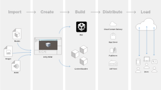

In Unity, an AssetBundle is a file that contains assets, such as models, textures, audio clips, or other types of data, bundled together for easy distribution and loading at runtime. AssetBundles are commonly used to optimize the loading times of large projects, reduce the initial download size of a game, or support dynamic content updates.

Here are some key points about AssetBundles in Unity:

1. Packaging Assets: AssetBundles allow you to package assets separately from the main project build. This means you can distribute additional content, updates, or downloadable content (DLC) without having to rebuild the entire game.

2. Reduced Build Size: By packaging assets into AssetBundles, you can reduce the size of the initial build of your game. Instead of including all assets in the main build, you can distribute them as needed, improving download times and reducing storage requirements.

3. Dynamic Loading: AssetBundles can be loaded at runtime, allowing you to dynamically load assets as needed during gameplay. This can be useful for streaming large levels, loading assets on-demand, or supporting procedural content generation.

4. Platform Independence: AssetBundles are platform-independent, meaning you can build them once and deploy them across different platforms, such as PC, consoles, mobile devices, or web browsers.

5. Versioning and Updating: AssetBundles support versioning, allowing you to manage different versions of assets and handle updates efficiently. You can distribute new versions of AssetBundles to players without requiring a full game update.

6. Asset Compression: Unity provides options for compressing AssetBundles to reduce file size and improve download times. You can choose from different compression methods, such as LZMA, LZ4, or uncompressed.

7. Asset Dependency Tracking: AssetBundles support dependency tracking, meaning that if one AssetBundle depends on another, Unity will automatically load the required AssetBundles when needed.

8. AssetBundle Variants: Unity supports AssetBundle variants, allowing you to build different versions of AssetBundles for specific scenarios, such as different languages, screen resolutions, or device capabilities.

To create and use AssetBundles in Unity, you typically follow these steps:

1. Build AssetBundles: Use Unity's Build Pipeline to build AssetBundles from the assets in your project. You can specify which assets to include in each AssetBundle and configure compression settings.

2. Deploy AssetBundles: Once you have built the AssetBundles, you can deploy them to your target platform, either hosting them on a server or bundling them with your game build.

3. Load AssetBundles: In your game code, use Unity's AssetBundle API to load AssetBundles at runtime. You can then access the assets contained within the AssetBundles and instantiate them in your scene.

4. Unload AssetBundles: After you have finished using assets from an AssetBundle, you can unload the AssetBundle to free up memory. Unity will automatically handle unloading unused assets and dependencies.

Overall, AssetBundles are a powerful feature in Unity for managing and distributing assets in your projects efficiently. They provide flexibility, performance optimizations, and support for dynamic content updates, making them essential for many game development workflows.

